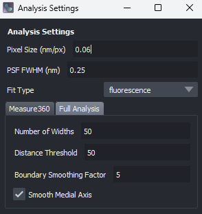

# Analysing images using the napari plugin
!!! warning
    This page is still work in progress, so some parts may be incomplete or missing. We are working on it!

The napari plugin is designed to allow you to analyse your images and interact with parameters such as filters, 
segmentation methods etc to optimise the analysis before using the batch tools to analyse multiple images in one go. 
The plugin also has basic plotting functionalities which should allow you to get a sense of whether results make 
sense or not.

Generally, analysis will consist of the following steps:

1. Open `napari` and load the plugin
2. Load an image (or single-channel stack)
3. Load a mask, or use omnipose to segment your image
4. Check the segmentation and adjust parameters if necessary
5. Use one of two methods to analyse the image(s)
6. Interact with the result, using the basic plotting functionalities
7. Save the results and note down parameters used for analysis, to replicate in the batch tools mode

We will now go through each of these steps in more detail.

## Opening napari and the plugin
Open napari whichever way you prefer. For example, from the terminal by typing: `napari`. Once napari is open, you 
can select the plugin from the `Plugins` menu, and select `Bacteria Morphology Toolkit`.

(Insert image of napari with plugin loaded - TBD when final layout is decided)

## Loading an image
You can load an image by clicking on the `File` menu, and selecting `Open File(s)`. This will open a file dialog 
where you can select the image you want to analyse. You can also drag and drop an image into the napari window.

Alternatively, you can drop an image into the napari window, and it will be loaded automatically.

(Insert image of napari with image loaded)

## Segmenting the image
We will now segment the image using one of the pre-trained omnipose models. Clicking on the `Segmentation Settings` 
button will open up the following menu:

Here you can select the model you want to use, and adjust the parameters. Once you are happy with the settings, just 
close the window and they will be saved.

After that, just click on `Run Segmentation` and the segmentation will be performed.

(Insert image of napari with segmentation performed)

You can now proceed to the analysis step, or use the `Mask filter utility` to remove objects that were segmented 
by mistake - an example would be to remove bright spots which the segmentation algorithm thought were bacteria.

## Analysing the image

We will now analyse the image using the `Run full analysis` button. Before we do however, let us check the analysis 
settings by clicking on the `Analysis Settings` button:

The key parameters which you need to set up here are the pixel size of your image, the full-width half-maximum of 
your microscope's psf (point spread function), and the fit type (i.e. whether you are analysing a phase contrast or 
fluorescence microscopy image).

You can also adjust other parameters applied during the analysis. Specifically, the parameters for each mode are the 
following:

**Full Analysis**

- `Number of Widths`: The number of widths to fit for each bacterium
- `Boundary Smoothing Factor`: The number of frequencies to be kept during the boundary smoothing process.

**Measure360**

- `Number of Widths`: The number of widths to fit for each bacterium, i.e. how many angles to measure the width at.
- `Filter Results` will allow you to apply a filter to the Measure360 to remove any spurious measurements. 
  `Derivative` makes sure to remove any results which would be considered spurious due to the derivative of the 
  curve being too high at that point.

## Exporting the results

Results can be exported using the dedicated buttons, in either `csv` or `pickle` formats. The `csv` format will have 
reduced information, while the `pickle` file will contain the full list of Bacteria objects.
(This is likely to change in the future as we move towards being able to export results in a more standardised 
format, such as .hdf5).